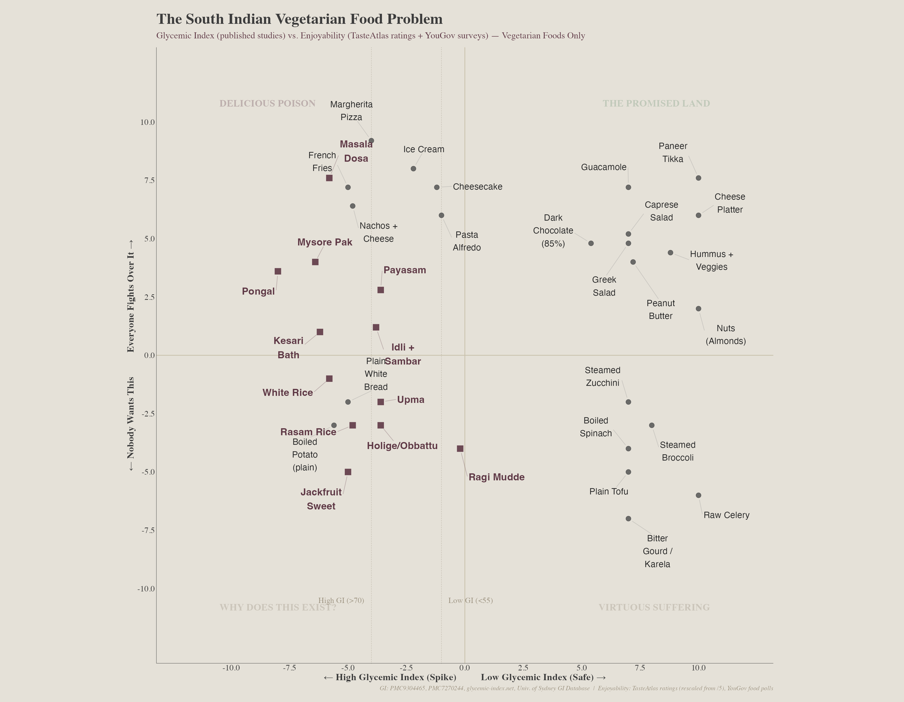

# The South Indian Vegetarian Food Problem

A 2x2 scatter plot that maps vegetarian foods on two axes:
- **X-axis: Glycemic Index** (from published peer-reviewed studies)
- **Y-axis: Enjoyability** (from TasteAtlas crowd-sourced ratings + YouGov food preference surveys)

The hypothesis: traditional South Indian vegetarian food - the kind made in Kannada homes for festivals - is uniquely terrible on both dimensions. It clusters in the bottom-left quadrant (high glycemic index AND low enjoyability) in a way that no other cuisine's food does.

## The Chart



## Data Sources

### Glycemic Index (X-axis)
- **PMC9304465** (2022) - "Glycemic carbohydrates, glycemic index, and glycemic load of commonly consumed South Indian breakfast foods." Peer-reviewed study that tested 23 South Indian foods on human subjects using ISO methodology.
- **PMC7270244** - Millet-based food study (ragi mudde GI values)
- **glycemic-index.net** / **University of Sydney GI Database** - for non-Indian foods
- **Harvard Health GI Tables** / **International Tables of GI/GL Values 2021**

### Enjoyability (Y-axis)
- **TasteAtlas** ratings (out of 5, rescaled to -10 to +10 scale using formula: `enjoy = (rating - 2.5) * 4`)
- **YouGov** food popularity surveys (for foods not rated on TasteAtlas)

## Running

The chart is generated in R:

```r
Rscript south-indian-food-2x2.R
```

Requires: `ggplot2`, `ggrepel`, `ggthemes`, `stringr`, `dplyr`

There's also a Python version (`south-indian-food-2x2.py`) but the R version produces better label placement via `ggrepel`.

## Aesthetic

Uses the "Bangalore weather chart" aesthetic: warm beige background (#e5e1d8), Tufte minimalism, no gridlines, muted color palette. Based on Edward Tufte's principles of data visualization.
